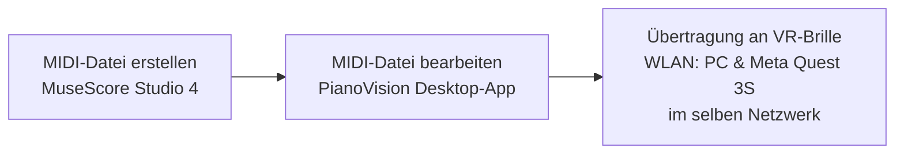
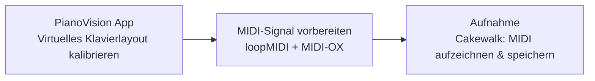

```mermaid
graph LR
    A[MIDI-Datei erstellen\nMuseScore Studio 4] --> B[MIDI-Datei bearbeiten\nPianoVision Desktop-App]
    B --> C[Übertragung an VR-Brille\nWLAN: PC & Meta Quest 3S\nim selben Netzwerk]

```

```mermaid
graph LR
    D[PianoVision App\nVirtuelles Klavierlayout kalibrieren] --> E[MIDI-Signal vorbereiten\nloopMIDI + MIDI-OX]
    E --> F[Aufnahme\nCakewalk: MIDI aufzeichnen & speichern]
```

